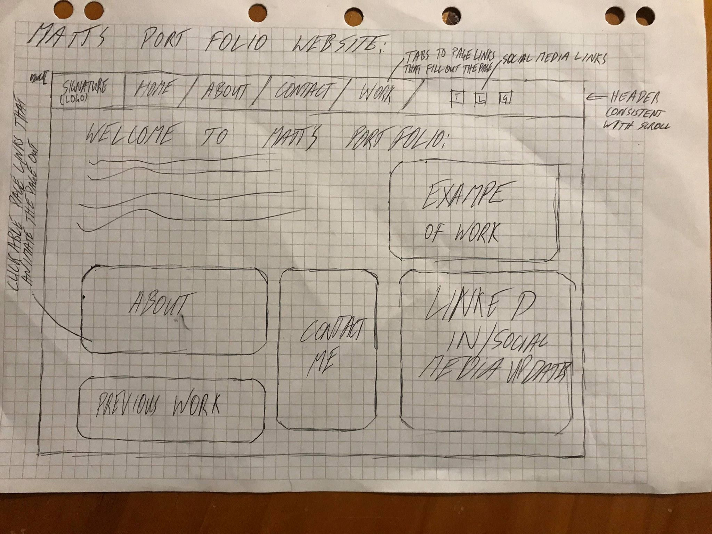
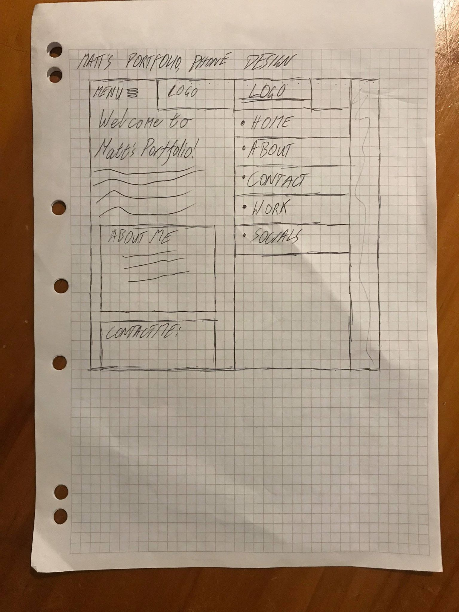
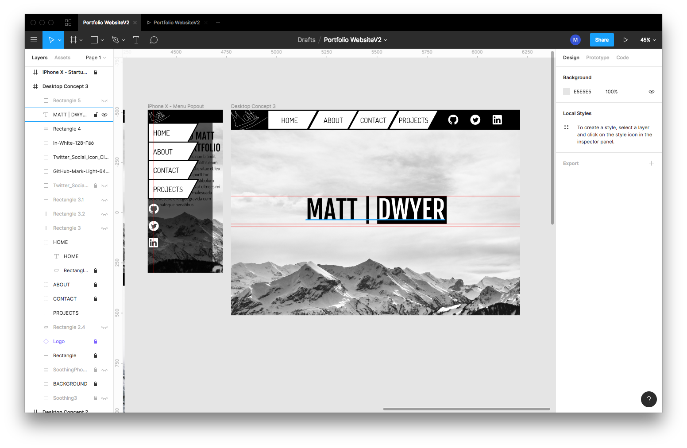
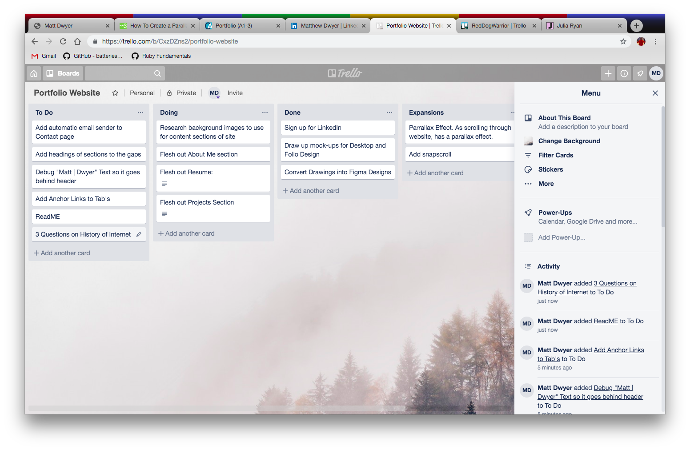

# **Portfolio Website** 
To display to prospective employers and other developers my coding experiences and projects. 

## **Design:**
I decided that for my portfolio website I'd only use HTML and CSS to code the site. 

My original idea for my website involved a dynamic, single paged website, involving limited scrolling and dynamic panels that when clicked on would animate out and display the information on that page, however, after some research I discovered that this wouldn't be possible without Javascript.

After some delibiration and playing around with some ideas, I decided on setting on a single page website, with scrolling, anchor links and a set menu header, that would transform once it got below a certain pixel size.

I then proceeded to digitise my designs, using Figma. 

During this process I was also able to experiment with different colour schemes. 

#### Colour Scheme

I struggled to find a colour scheme which I felt I could comfortably incorporate into my design, so I decided to stick with the black and white setting.

#### Fonts
To select my font style, I used the site Fontjoy: https://fontjoy.com/ to select the fonts I wanted to use.

## **Planning:**

Trello was used to help plan and track progress of the project. 

## **Development:**
The main programming tools used for the site were Visual Studio Code, where the only two languages used were HTML and CSS. 

First stage of development involved creating the backgrounds for each of the sections of the site. 

The header was next up, where I struggled to wrap my head around the best way to use grid and flexbox simply to get the result I wanted. After some deliberation and trial and error, I got the result that was apart of the final design. I still struggled upon release to remove the blue text from the tabs though. 

For the background images, I used photos from the site https://www.shutterstock.com/home. I decided to find photos from major capital cities, such as Paris, Shanghai and New York, as well as a drone photograph of my hometown I took. I then converted these images to black and white. 

After this I then filled out the sections with the relevant information about myself and relevant forms/downloads (e.g. Contact Form and Resume Download).

I then moved onto the challenge of using Media Queries to make my site readable on an iPhone/Android in a portrait view. 
I'm still yet to set up the media queries for iPad/Tablet or iPhone in a landscape view.

Another major feature of adding the media query for the iPhone/Mobile was transforming, hiding and re-writing the rules of the Desktop nav-bar and replacing them with what was necessary for the Mobile Menu I had designed.

## **Challenges and Thoughts:**
Trying to figure out the alignment and correct ways to use flexbox and grid, just to align items was a struggle to begin with, but once I got my head wrapped around it, the process became a lot easier. 

#### Readability:
I'm currently not happy with the readability of my site, especially on iPhone/Android. I'll need to make a further update to add a different photo that stetches further down the page and makes the content easier to read. 

#### Navigation: 
The page is a single page act, so anchor links are used to navigate the page. 

On mobile, when the Menu pops down, once you click the link you want to go to, you have to manually click menu again to toggle it away. This is a feature I'd like to fix.

Currently, the links in the header also only work if you click the text, and not the whole tab, this is an immediate problem that needs resolving.

#### Compatibility and Display:

I've struggled to test the compatibility, however, I am aware that there'll be issues if you tried to load this site on a iPad/Tablet. A new ruleset with media queries would be required here, where maybe I shrink the size of the Desktop Menu, or create a new menu entirely that could be used for phones on a landscape display as well.

#### Missing Features and Expansion:
There's currently missing functions and links to GitHub, Twitter and LinkedIn on the iPhone Menu as well. These all need to be added.  

The Resume and Projects section needs more content, such as a download button on the Resume Section. I'd also like to add a preview in that section that displays the resume, that the user could scroll through, without having to download it. 

I would also like to add: 
* Snap-scrolling - This maybe more difficult if I have to stretch the page, but I feel it would be good for sections such as the Resume and Contact section so users don't get lost

* Parallax Effect - As users scroll through the site on desktop, a parallax effect is used to make the site more dynamic. 

* CSS Animation - On the site loading, I would like to see the "Matt | Dwyer" Logo pop up from behind mountains. This would require a little bit of photoshop and playing around once I got the images lined up, but I believe that it would be a cool effect.

Overall, I am happy and pleased with how the black and white colour scheme ended up working. I believe the logo of the site looks really sharp. I also enjoy the way the header and tabs look, I'm just disappointed that there's still blue text over it.

## Coder Academy Assignment Questions and Responses:

**Q1. Describe key events in the development of the internet from the 1980s to today. (max. 150 words)** 

The internet was created by ARPA, to interconnect computers across selected research centres and Colleges in the USA. The core elements that made up the internet back then are still the backbone of the internet today, these elements are: 
- Packets: packets are used to transport and communicate information across networks
- Transmission Control Protocols/Internet Protocols (ICP/IP): TCP’s and IP’s are in place so that all computers communicate in the same global language.
- Domain Name System (DNS): The DNS came in place, and was used to organise addresses of all computers across networks

These were the core ingredients for the recipe that made up the internet in the 1980’s. 
However, during the late 1980’s, the creation of the world wide web (www) came about and was a way to navigate the internet using HyperText. Hypertext was used to link between web pages. 

**Q2. Define and describes the relationship between fundamental aspects of the  internet such as: domains, web servers, DNS, and web browsers. (max. 150 words)**

- The DNS is the address book of the internet. 
- The domain is the readable name of the an IP address of a website. 
- Web browsers are used to display, retrieve information from web servers on your computer.
- Web servers are used to store data that is used on websites. 

When you go to access a domain, such as 'google.com', the web browser (e.g. Mozilla Firefox) interacts with the IP addresses and the DNS translate the domain name into an IP address so the browser can load the internet resource/information. The information that the browser is retrieving is stored on a web server, this server also has its own unique IP address.

**Q3. Reflect on one aspect of the development of internet technologies and how it has contributed to the world today(max. 150 words)**

Cookies: 

Intended Use: 

- To Store information on the users computer, rather than the server (to decrease the amount of data stored on the server). 
    - E.g. if you log into Twitter, Twitter sends back the verification that you’ve logged in and sends a cookie back to your computer as well. This cookie acts as a ‘key’ and allows you to navigate the rest of the site, without having to log in again, every time you open a new page on twitter.com

Tracking issues with cookies:

- Companies such as Google, Twitter and Facebook, use cookies to track their users across multiple sites. Even though cookies are bound to the original website, when another site puts in code from Facebook, such as “Like us on Facebook!”, the other site your own has to download the code from Facebook and sends your cookie along with it. Because of this, Facebook knows who you are and that you’ve visited this site. 

Companies use this tracking to analyse what you’ve been looking at, and use it to decide what you want to look at next. This works especially well for advertising or what pops up on your “Watch Next” playlist on YouTube. 

